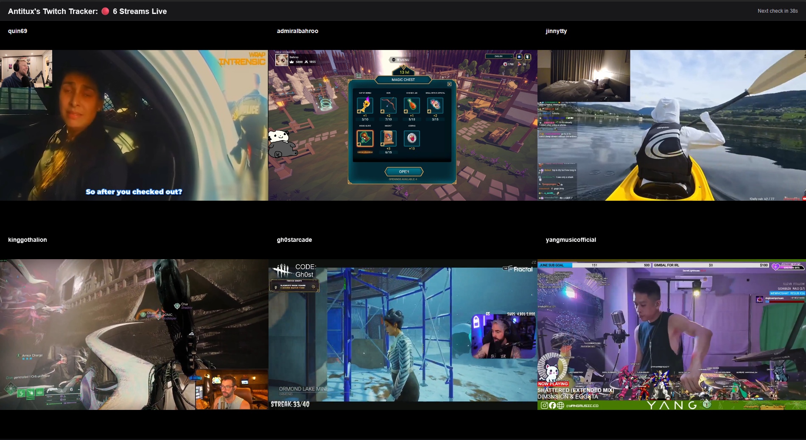
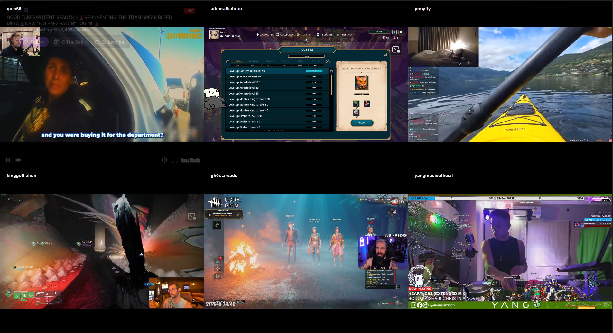

# Twitch Stream Tracker

A Flask-based web application that displays all your followed Twitch streams in a dynamic grid layout. The app automatically checks for stream status changes and refreshes when streamers go live or offline.

## Features

- **Multi-stream grid view** - Watch multiple Twitch streams simultaneously
- **Auto-refresh** - Automatically detects when followed channels go live or offline
- **Responsive grid layout** - Dynamically adjusts grid based on number of active streams
- **Sorted by viewers** - Streams are ordered by viewer count (highest first)
- **Docker support** - Easy deployment with Docker/docker-compose
- **NOTE: <span style="color:red;"><u>FOR THE BEST RESULTS, USE A FIREFOX-BASED BROWSER!! CHROME-BASED BROWSERS DO NOT LIKE TO AUTOPLAY LARGE NUMBERS OF VIDEOS AT ONCE!!</u></span>**
## Screenshots

**Multiple streams with header:**


**Fullscreen mode (header hidden):**


## Prerequisites

- Docker and Docker Compose (recommended)
- OR Python 3.11+ (for local development)
- Twitch account with:
  - Client ID
  - OAuth Access Token
  - Your Twitch User ID

## Getting Your Twitch Credentials

1. **Get Client ID and OAuth Token:**
   - Visit [Twitch Token Generator](https://twitchtokengenerator.com/)
   - Click "Generate Token"
   - Select scopes: `user:read:follows`
   - Authorize with your Twitch account
   - Copy your **Client ID** and **Access Token**

2. **Get Your User ID:**
   - Visit [Twitch ID Lookup](https://www.streamweasels.com/tools/convert-twitch-username-to-user-id/)
   - Enter your Twitch username
   - Copy your **User ID**

## Installation

### Option 1: Docker (Recommended)

1. **Clone the repository:**
```bash
git clone https://github.com/antitux/twitch-tracker.git
cd twitch-stream-tracker
```

2. **Create a `.env` file:**
```bash
CLIENT_ID=your_client_id_here
ACCESS_TOKEN=your_access_token_here
USER_ID=your_user_id_here
PARENT_DOMAIN=yourdomain.com
```

3. **Run with docker-compose:**
```bash
docker-compose -f docker-compose-example.yml up -d
```

4. **Access the app:**
Open `http://localhost:5000` in your browser

### Option 2: Local Development

1. **Clone the repository:**
```bash
git clone https://github.com/yourusername/twitch-stream-tracker.git
cd twitch-stream-tracker
```

2. **Create a virtual environment:**
```bash
python -m venv venv
source venv/bin/activate  # On Windows: venv\Scripts\activate
```

3. **Install dependencies:**
```bash
pip install -r requirements.txt
```

4. **Set environment variables:**
```bash
export CLIENT_ID=your_client_id_here
export ACCESS_TOKEN=your_access_token_here
export USER_ID=your_user_id_here
export PARENT_DOMAIN=localhost
```

5. **Run the application:**
```bash
python app.py
```

6. **Access the app:**
Open `http://localhost:5000` in your browser

## Docker Compose Configuration

**docker-compose.yml:**
```yaml
version: '3.8'

services:
  twitch-tracker:
    image: antitux/twitch-tracker:latest
    pull_policy: always
    container_name: twitch-tracker
    ports:
      - "5000:5000"
    environment:
      # Get these from twitchtokengenerator.com
      - CLIENT_ID=YOUR_CLIENT_ID
      - ACCESS_TOKEN=YOUR_CLIENT_TOKEN
      - USER_ID=YOUR_USER_ID
      # The domain the server is available on.
      # Use localhost if just running locally.
      - PARENT_DOMAIN=localhost
    restart: unless-stopped
```

## Configuration

### Environment Variables

| Variable | Required | Description |
|----------|----------|-------------|
| `CLIENT_ID` | Yes | Your Twitch application Client ID |
| `ACCESS_TOKEN` | Yes | OAuth token with `user:read:follows` scope |
| `USER_ID` | Yes | Your Twitch user ID |
| `PARENT_DOMAIN` | Yes | Domain where the app is hosted (for Twitch embed) |

### URL Parameters

| Parameter | Values | Description |
|-----------|--------|-------------|
| `hide_header` | `true`, `1`, `yes` | Hides the header bar for fullscreen mode |

#### Example:

https://localhost:5000/?hide_header=true

## Project Structure

```
twitch-tracker/
├── app.py                          # Main Flask application
├── requirements.txt                # Python dependencies
├── Dockerfile                      # Docker configuration
├── docker-compose.yml              # Docker Compose configuration
├── templates/                      # Templates
│ ├── base.html                     # Base template
│ ├── streams.html                  # Multi-stream view
│ └── no_streams.html               # No streams view
└── scripts/                        # Helper scripts for running Firefox on Ubuntu Desktop in kiosk mode.
│ └── README.md                     # Helper Scripts README.md
│ └── firefox_desktop_restart.sh    # Restarts Firefox remotely
│ └── firefox_reload.py             # Refreshes Firefox via Marionette api
│ └── firefox.desktop               # Automatically launches Firefox on boot
│ └── xhost.desktop                 # Enables remote X11 sessions
└── static/                         # Static CSS and Javascript
  ├── css/                          # Static CSS Files
  │ ├── streams.css                 # CSS for when streams are live
  │ └── no_streams.css              # CSS For when streams are not live
  └── js/                           # Static Javascript Files
  ├── streams.js                    # Javascript for when streams are live
  └── no_streams.js                 # Javascript for when streams are not live

```

## How It Works

1. **Fetches followed channels** from the Twitch API using your credentials
2. **Checks live status** for all followed channels every 60 seconds
3. **Automatically refreshes** the page when streams go live or offline
4. **Arranges streams** in an optimized grid layout (1x1 up to 6x6+)
5. **Sorts by viewer count** to prioritize popular streams
6. **Embeds Twitch players** with automatic muting and 480p quality

## API Endpoints

### `GET /`
Main page - displays either the streams grid or "no streams" message

### `GET /api/live-streams`
JSON API endpoint that returns current live streams

#### Response:
```json
{
  "usernames": ["streamer1", "streamer2", "streamer3"],
  "count": 3
}
```

## Grid layouts

The app automatically calculates the optimal grid based on stream count:

- 1 stream: 1x1
- 2 streams: 2x1
- 3 streams: 3x1
- 4 streams: 2x2
- 5-6 streams: 3x2
- 7-9 streams: 3x3
- 10-12 streams: 4x3
- 13-16 streams: 4x4
- 17-20 streams: 5x4
- 21-25 streams: 5x5
- 26-30 streams: 6x5
- 31-36 streams: 6x6
- 36+ streams: Calculated dynamically

## Troubleshooting

### Streams not autoplaying
- Firefox is the recommended browser for the best experience with this application
- Some browsers may block autoplay by default due to their autoplay policies
- For a fullscreen kiosk experience, run Firefox in kiosk mode:
```bash
firefox --kiosk http://localhost:5000/?hide_header=true
```
- On Linux with X11, you can also use:
```bash
firefox --kiosk --new-window http://localhost:5000/?hide_header=true
```

### Streams not loading

- Verify your `PARENT_DOMAIN` matches the domain you're accessing the app from
- For localhost, use `PARENT_DOMAIN=localhost`
- For production, use your actual domain (e.g., `example.com`)

### Auto-refresh not working

- Check browser console for errors
- Ensure the app can reach `/api/live-streams`
- Verify your OAuth token hasn't expired

### "No streams live" when streams are active

- Confirm your `USER_ID` is correct
- Check that your OAuth token has the `user:read:follows` scope
- Verify you're actually following the streamers on Twitch

### Template not found errors

- Ensure `templates/` and `static/` directories are copied correctly
- Check Docker build logs for copy errors
- Verify file permissions

## Contributing

Contributions are welcome! Please feel free to submit a Pull Request.

1. Fork the repository
1. Create your feature branch (`git checkout -b feature/AmazingFeature`)
1. Commit your changes (`git commit -m 'Add some AmazingFeature'`)
1. Push to the branch (`git push origin feature/AmazingFeature`)
1. Open a Pull Request

## License

This project is licensed under the GNU Affero General Public License v3.0 - see the [LICENSE](LICENSE) file for details.

Copyright © 2026 Antitux Networks LLC

## Acknowledgments

- Built with [Flask](https://flask.palletsprojects.com/)
- Uses [Twitch API](https://dev.twitch.tv/docs/api/)
- Deployed with [Gunicorn](https://gunicorn.org/)

## Support

If you encounter any issues or have questions:
- Open an issue on GitHub
- Check existing issues for solutions
- Review the Twitch API documentation
